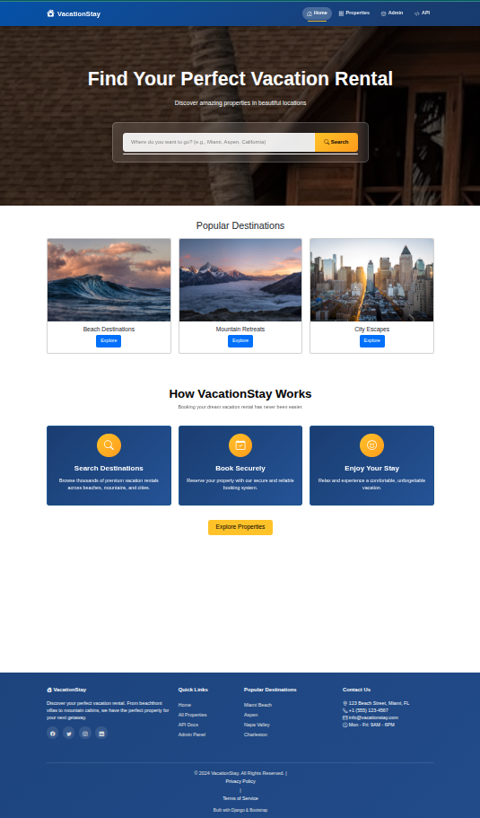
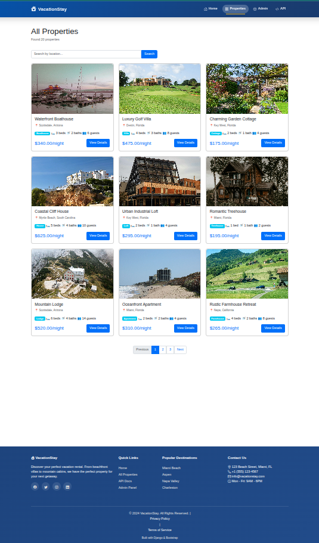
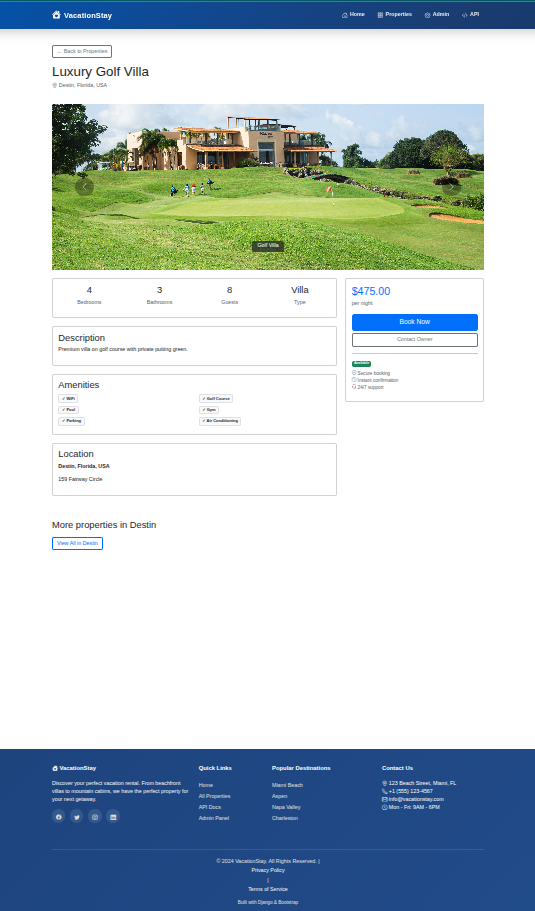

# Vacation Rental Property Management System

A full-featured Django web application for managing vacation rental properties with a modern, responsive interface and RESTful API.


## Table of Contents

- [Features](#features)
- [Demo](#demo)
- [Technology Stack](#technology-stack)
- [Installation](#installation)
- [Configuration](#configuration)
- [Usage](#usage)
- [API Documentation](#api-documentation)
- [Project Structure](#project-structure)
- [Contributing](#contributing)
- [License](#license)

## Features

### Core Features
- **Property Management** - Complete CRUD operations for vacation rental properties
- **Location-based Search** - Search properties by location with autocomplete
- **Multi-Image Upload** - Upload and manage multiple images per property
- **Admin Dashboard** - Comprehensive admin interface with inline image editing
- **Smart Search** - Real-time autocomplete search with location suggestions
- **Responsive Design** - Mobile-friendly interface built with Bootstrap 5
- **RESTful API** - Complete REST API with Django REST Framework
- **CSV Import** - Bulk import properties and locations from CSV files
- **Pagination** - Efficient data pagination (9 properties per page)

### Advanced Features
- **Glass Morphism UI** - Modern frosted glass effect on search interface
- **Image Carousel** - Beautiful property image galleries
- **Filtering System** - Filter by location, type, bedrooms, availability
- **Professional Admin** - Customized Django admin with filters and inline editing
- **API Endpoints** - JSON endpoints for locations and properties

## Demo

### Screenshots

<details>
<summary><b>Home Page with Search</b> (Click to expand)</summary>



</details>

<details>
<summary><b>Property Listing</b> (Click to expand)</summary>



</details>

<details>
<summary><b>Property Details</b> (Click to expand)</summary>



</details>


## Technology Stack

### Backend
- **Django 5.0+** - High-level Python web framework
- **Django REST Framework 3.14+** - Toolkit for building Web APIs
- **Python 3.8+** - Programming language
- **SQLite** - Database (easily switchable to PostgreSQL/MySQL)

### Frontend
- **Bootstrap 5.3** - CSS framework
- **Bootstrap Icons** - Icon library
- **JavaScript (Vanilla)** - For autocomplete and interactions
- **HTML5 & CSS3** - Markup and styling

### Additional Tools
- **Pillow** - Python Imaging Library for image handling
- **django-filter** - Reusable Django application for filtering querysets
- **UV** - Fast Python package installer (recommended)

## Installation

### Prerequisites

- Python 3.8 or higher
- pip or UV package manager
- Git

### Step 1: Clone the Repository

```bash
git clone https://github.com/Ali-ahsan35/vacation_rental_A7.git
cd vacation_rental_A7
```

### Step 2: Set Up Virtual Environment

**Using UV (Recommended):**

```bash
# Install UV
curl -LsSf https://astral.sh/uv/install.sh | sh  # macOS/Linux
# OR
powershell -c "irm https://astral.sh/uv/install.ps1 | iex"  # Windows

# Create and activate virtual environment
uv venv
source .venv/bin/activate  # macOS/Linux
# OR
.venv\Scripts\activate  # Windows
```

**Using Standard Python venv:**

```bash
python -m venv venv
source venv/bin/activate  # macOS/Linux
# OR
venv\Scripts\activate  # Windows
```

### Step 3: Install Dependencies

**Using UV:**
```bash
uv pip install -r requirements.txt
```

**Using pip:**
```bash
pip install -r requirements.txt
```

### Step 4: Apply Database Migrations

```bash
python manage.py makemigrations
python manage.py migrate
```

### Step 5: Create Superuser (Admin Account)

```bash
python manage.py createsuperuser
```

Enter your desired username, email, and password when prompted.

### Step 6: Import Sample Data (Optional)

**Import Locations:**
```bash
python manage.py import_locations data/locations.csv
```

**Import Properties:**
```bash
python manage.py import_properties data/properties_no_location.csv --skip-location
```

> **Note:** After importing properties, you need to assign locations to properties via the admin panel.

### Step 7: Create Media Directories

```bash
mkdir -p media/property_images
```

### Step 8: Run Development Server

```bash
python manage.py runserver
```

The application will be available at: **http://127.0.0.1:8000/**

## Configuration

### Settings

Key configuration options in `config/settings.py`:

```python
# Database
DATABASES = {
    'default': {
        'ENGINE': 'django.db.backends.sqlite3',
        'NAME': BASE_DIR / 'db.sqlite3',
    }
}

# Media Files (User Uploads)
MEDIA_URL = '/media/'
MEDIA_ROOT = BASE_DIR / 'media'

# Pagination
REST_FRAMEWORK = {
    'PAGE_SIZE': 10,
}
```

## Usage

### Accessing the Application

- **Home Page:** http://127.0.0.1:8000/
- **Property List:** http://127.0.0.1:8000/properties/
- **Admin Panel:** http://127.0.0.1:8000/admin/
- **API Root:** http://127.0.0.1:8000/api/

### Admin Panel Workflow

1. **Login:** Visit `/admin/` and login with superuser credentials

2. **Add Locations:**
   - Navigate to **Locations** → **Add Location**
   - Fill in: Name, City, State, Country
   - Save

3. **Manage Properties:**
   - Navigate to **Properties**
   - Click on a property to edit
   - Select a location from dropdown
   - Scroll to **Property Images** section
   - Upload images (3-5 recommended)
   - Check **"Is primary"** for the main image
   - Save

### Using CSV Import

**Location CSV Format:**
```csv
name,city,state,country,description
Miami Beach,Miami,Florida,USA,Beautiful coastal destination
Aspen,Aspen,Colorado,USA,Premier ski resort town
```

**Property CSV Format:**
```csv
title,description,property_type,bedrooms,bathrooms,max_guests,price_per_night,address,amenities,is_available
Luxury Villa,Beautiful property...,Villa,5,4.5,10,450.00,123 Ocean Dr,"WiFi,Pool,Kitchen",true
```

**Import Commands:**
```bash
python manage.py import_locations data/locations.csv
python manage.py import_properties data/properties.csv --skip-location
```

## API Documentation

### Endpoints

| Endpoint | Method | Description |
|----------|--------|-------------|
| `/api/locations/` | GET | List all locations |
| `/api/locations/{id}/` | GET | Get location details |
| `/api/locations/autocomplete/?q={query}` | GET | Autocomplete search (min 2 chars) |
| `/api/properties/` | GET | List all properties (paginated) |
| `/api/properties/{id}/` | GET | Get property details |
| `/api/properties/?location={name}` | GET | Filter properties by location |

### Example API Calls

**Get all locations:**
```bash
curl http://127.0.0.1:8000/api/locations/
```

**Autocomplete search:**
```bash
curl http://127.0.0.1:8000/api/locations/autocomplete/?q=miami
```

**Filter properties by location:**
```bash
curl http://127.0.0.1:8000/api/properties/?location=Miami
```

### Response Format

**Location Autocomplete:**
```json
[
  {
    "id": 1,
    "name": "Miami Beach",
    "city": "Miami",
    "state": "Florida",
    "country": "USA"
  }
]
```

**Property Detail:**
```json
{
  "id": 1,
  "title": "Luxury Beachfront Villa",
  "description": "Beautiful property...",
  "location": {
    "id": 1,
    "name": "Miami Beach",
    "city": "Miami",
    "state": "Florida",
    "country": "USA"
  },
  "bedrooms": 5,
  "bathrooms": "4.5",
  "price_per_night": "450.00",
  "images": [
    {
      "id": 1,
      "image": "/media/property_images/villa.jpg",
      "is_primary": true
    }
  ]
}
```

## Project Structure

```
vacation_rental_A7/
├── config/                     # Project configuration
│   ├── settings.py             # Django settings
│   ├── urls.py                 # Main URL routing
│   └── wsgi.py                 # WSGI configuration
├── locations/                  # Location app
│   ├── models.py               # Location model
│   ├── admin.py                # Location admin
│   └── management/
│       └── commands/
│           └── import_locations.py
├── properties/                 # Property app
│   ├── models.py               # Property model
│   ├── admin.py                # Property admin
│   ├── views.py                # Frontend views
│   ├── urls.py                 # Property URLs
│   ├── api_serializers.py      # DRF serializers
│   ├── api_views.py            # API viewsets
│   ├── api_urls.py             # API routing
│   └── management/
│       └── commands/
│           └── import_properties.py
├── images/                     # Image app
│   ├── models.py               # PropertyImage model
│   └── admin.py                # Image admin
├── templates/                  # HTML templates
│   ├── base.html               # Base template
│   └── properties/
│       ├── home.html           # Home page
│       ├── property_list.html  # Property listing
│       └── property_detail.html
├── media/                      # User uploads (gitignored)
│   └── property_images/
├── data/                       # Sample CSV data
│   ├── locations.csv
│   └── properties_no_location.csv
├── manage.py                   # Django CLI
├── requirements.txt            # Python dependencies
└── README.md                   # This file
```

## Key Features Explained

### 1. Location Autocomplete
Real-time search suggestions as you type. Searches across location name, city, and state. Minimum 2 characters required.

### 2. Multi-Image Upload
Upload multiple images per property using Django's inline admin. Mark one image as primary for thumbnails.

### 3. Glass Morphism Design
Modern UI with frosted glass effect on the search box using CSS backdrop-filter.

### 4. Responsive Layout
Mobile-first design that works on all devices. Bootstrap 5 grid system for layout.

### 5. Sticky Footer
Footer always stays at the bottom of the page, even with minimal content.

### 6. CSV Bulk Import
Import hundreds of properties or locations at once from CSV files.

## Testing

### Manual Testing Checklist

- [ ] Home page loads correctly
- [ ] Search autocomplete works (type "fl" to test)
- [ ] Property list shows all properties
- [ ] Filtering by location works
- [ ] Pagination works (navigate between pages)
- [ ] Property detail page shows images
- [ ] Image carousel works (if multiple images)
- [ ] Admin panel is accessible
- [ ] Can create/edit locations in admin
- [ ] Can upload images in admin
- [ ] API endpoints return JSON

### Test Data

Sample CSV files are provided in the `data/` directory:
- `properties_no_location.csv` - 20 sample properties

## Troubleshooting

### Common Issues

**Port already in use:**
```bash
python manage.py runserver 8080  # Use different port
```

**Static files not found:**
```bash
python manage.py collectstatic
```

**Database migrations error:**
```bash
python manage.py migrate --run-syncdb
```

**Images not displaying:**
- Ensure `MEDIA_URL` and `MEDIA_ROOT` are configured
- Check that images are uploaded in admin
- Verify `DEBUG = True` in development

### Getting Help

If you encounter issues:
1. Check the error traceback carefully
2. Ensure all migrations are applied: `python manage.py migrate`
3. Verify virtual environment is activated
4. Check Django documentation: https://docs.djangoproject.com/

## Contributing

Contributions are welcome! Please follow these steps:

1. Fork the repository
2. Create a feature branch (`git checkout -b feature/AmazingFeature`)
3. Commit your changes (`git commit -m 'Add some AmazingFeature'`)
4. Push to the branch (`git push origin feature/AmazingFeature`)
5. Open a Pull Request

### Development Guidelines

- Follow PEP 8 style guide for Python code
- Write meaningful commit messages
- Add comments for complex logic
- Test your changes before submitting PR


##  Author

**Ali Ahsan**

- GitHub: [@Ali-ahsan35](https://github.com/Ali-ahsan35)
- Repository: [vacation_rental_A7](https://github.com/Ali-ahsan35/vacation_rental_A7)

## Acknowledgments

- Django Framework for the robust backend
- Bootstrap team for the UI components
- Django REST Framework for API capabilities
- Unsplash for sample property images
- All contributors and supporters

## Support

For support and questions:
- Open an issue on GitHub
- Check the documentation in this README

## Roadmap

Future enhancements planned:
- [ ] User authentication and profiles
- [ ] Booking system with calendar
- [ ] Payment integration
- [ ] Review and rating system
- [ ] Email notifications
- [ ] Advanced search filters
- [ ] Google Maps integration
- [ ] Multi-language support
- [ ] Mobile app (React Native)

